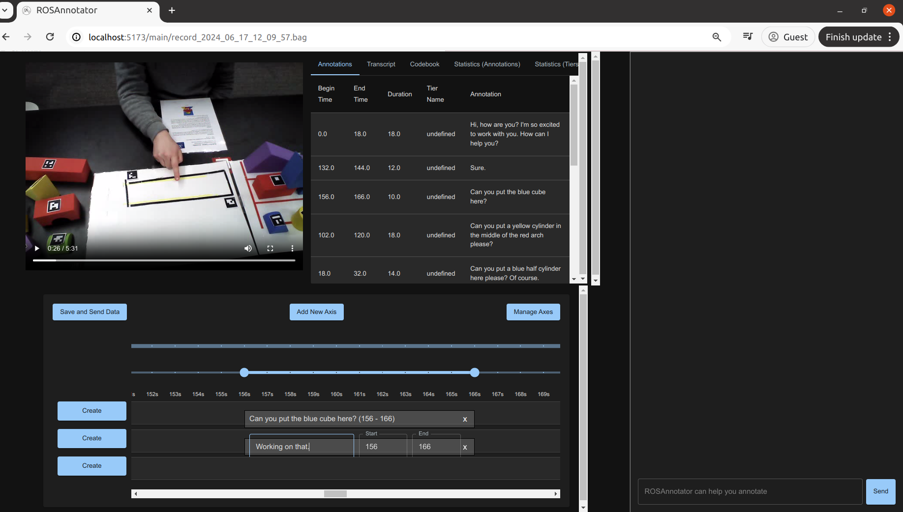

# ROSAnnotator
## Project Overview
ROSAnnotator is a web-based application that incorporates a Vision-Language Model (VLM) to support both manual and automated annotation of ROSBag data. The application is envisioned to be a versatile tool for researchers, enabling the loading of multiple ROSBags and the provision of a synchronized, interactive dashboard for intuitive data visualization. ROSAnnotator currently facilitates video, audio, and transcription annotations and provides an open interface for custom ROS messages and tools.

## Repository Structure

The ROSAnnotator project integrates ROS (Robot Operating System) with Django to process and annotate ROSBag files. The project also includes a React-based frontend for interacting with the annotations and managing data.

```
├── .github/         # GitHub configuration and workflows
├── data-samples/    # Sample data for testing
├── src/             # Source code for the project
│   ├── backend/    # Backend (Django) application code
│   │   ├── asgi.py # ASGI config
│   │   ├── wsgi.py # WSGI config
│   │   ├── urls.py # URL routing
│   │   ├── rosbag_processing/  # ROSBag processing code
│   │   │   ├── views.py        # API endpoints related to ROSBag
│   │   │   └── data_utils.py   # Data utilities related to ROSBag
│   │   ├── Dockerfile          # Dockerfile for backend
│   │   └── requirements.txt    # Python dependencies
│   └── frontend/   # Frontend (React) application code
│       ├── components/  # Reusable React components
│       └── pages/       # Page components for different routes
├── docker-compse.yml # Docker Compose config
└── datas/            # Will be created after building the Docker image
    ├── rosbag-data/ # Place your ROSBag data here
    ├── booklist/    # Place your predefined codebook here
    ├── annotation/  # Retrieve your annotation output here
    └── processed/   # Store all the processed data, e.g. extracted videos and transcriptions

```

## Installation

1. **General System Requirements**

   Minimum requirement: A laptop with at least a dual-core processor, 4GB of RAM, a 64-bit operating system, 25GB of available storage, and the capability to run Docker and a modern web browser.

   The code has been tested by this combination: Ubuntu 20.04 LTS, ROS Noetic, Python 3.9, Chrome version:130.0.6723.117.
   
3. **Prerequisites - Docker Installation**

   - Before you begin, ensure that you have Docker installed on your machine. If not, download and install Docker from [Docker's official site](https://www.docker.com/get-started).
   - Verify that the **Docker daemon** is running by executing `docker info` in your terminal. This should return information about the Docker client and server. If not, please start the Docker daemon.

4. **Starting the Server**

   First, clone this repo to your local device of any system (Windows, OS, Linux).

   Run the following commands in the root directory of the project:

   ```bash
   docker compose up --build
   ```

   > _Note: The total image size is about 20 GB, so it may take a while for the first time to download and build the image. The speed depends on your computational resources and internet connection._

   To stop the docker container:

   ```bash
   docker compose down
   ```

   To start the docker container again:

   ```bash
   docker compose up
   ```

   The `/datas` folder will be automatically generated after building the container. For Linux users, please check whether all users have read and write permission to this folder. If not, please run this command:

   ```bash
   sudo chmod -R 777 datas
   ```

5. **Environment**

    The application requires OpenAI API Key (ChatGPT) and Hugging Face Access Token. Before running it in docker, please create a .env file in the root path of **backend** and manually place two variables, **OPENAI_API_KEY** and **HUGGINGFACE_AUTH_TOKEN**, inside. Please restart the container after changing the .env file.

6. **Access the Application**

   Both the front end and the back end are hosted locally in a Docker container. Once the server is up and running, you can access the [web app](http://localhost:5173/) at `http://localhost:5173/`.

7. **Sample Data**

   We provided a sample ROSBag and a sample codebook in the folder `/data-samples`. The codebook needs to be in JSON format and put in the `/datas/booklist` folder. Please put the .bag file in the `/datas/rosbag-data` folder.

8. **Customised Data**

   The topics for video and audio data must be configured to match the corresponding topics in the ROSBag. In the sample ROSBag, the topic for video is `/xtion/rgb/image_raw_throttled`, and the topic for audio is `/audio`. Topic names can be modified in the `/src/backend/rosbag_processing/data_utils.py` file. If additional message types need to be extracted, they should also be defined within this file.

   For any custom tools, users should add the necessary functions in the `/src/backend/rosbag_processing/views.py` file. If users wish to customize prompts for the vision language model (VLM), they can modify them in the same file.

## Usage Guide
1. **Import Data**
    Put files in the correct folder.

    ```
    ├──  datas/        # Will be created after building the Docker image
        ├── rosbag-data/ # Place your ROSBag data here
        ├── booklist/    # Place your predefined codebook here
        ├── annotation/  # Retrieve your annotation output here
        └── processed/   # Store all the processed data, e.g. extracted videos and transcriptions
    ```

    Select your bag files, codebook (optional), and annotation file (if you need to retrieve your work) on the import page.

   

   The transcription may take several minutes, depending on the audio length.
   
   
   

2. **Manual Annotation**

   The transcription and codebook will appear at the top of the annotation page. The transcription will be automatically annotated in time axes.

   

   

   Click `Add new axis` to create a new annotation tier. In `Manage Axes`, users can change the name and type of the time axis. There are two types: `type-in` allows users to type any codes as annotation; `select` allows users to choose one code from the codebook via a drop-down list.

   In the annotation area, users can double-click to create a block for annotation. By clicking the block, users can edit the code, change the time interval, or delete it.

   There are two blue dots on the top of the time axis, which users can drag to mark a specific time, then click the `create` button on the left side of one of the time axis to create an annotation.

   In the toolbar panel, there is an `annotation` function. Users can see the summary of all the annotations in a table.

   

   Users can edit the pre-defined codebook from the toolbar. By clicking `save`, the codebook JSON file will be updated.

      

4. **Auto Annotation**

   Users can provide instructions in the chatbox, and the VLM can provide help after several minutes of processing. Instruction examples are:
   
   > Can you annotate all the request utterances made by participants in a new time axis?
   > 
   > Can you annotate the participant's attitudes in speech according to the codebook in a new time axis?
   > 
   > Can you annotate the participant's gestures in the video according to the codebook in a new time axis?

   The VLM's annotation is not always correct. Users can edit the annotation manually.

    

6. **Statistic Summary**
   
    In the toolbar panel, there are two statistic summary functions. Users can check both the summary of all annotations and the summary of annotations in different tiers.

7. **Save Data**

    **It is very important to click "Save and Send Data" before exiting ROSAnnotator.** The saved file will be in the `/datas/annotation` folder in CSV format so that users can retrieve their process by loading that file next time.

8. **Others**

   The transcription will be saved in `/datas/processed`. Users can generate the annotation for transcription again by deleting that file.

## Maintenance

We are dedicated to maintaining this project by addressing bugs, refining functionality, and keeping the documentation up to date. We encourage users to fork the repository for custom development and welcome contributions through pull requests, which we will review thoughtfully and collaboratively.

## Maintenance

ROSAnnotator has been used in the following papers: (coming soon)

## Citation

If you use our code or paper in your work, please cite the following:

```

```

## License

This repository is licensed under the MIT License with a [Commons Clause](https://commonsclause.com).


